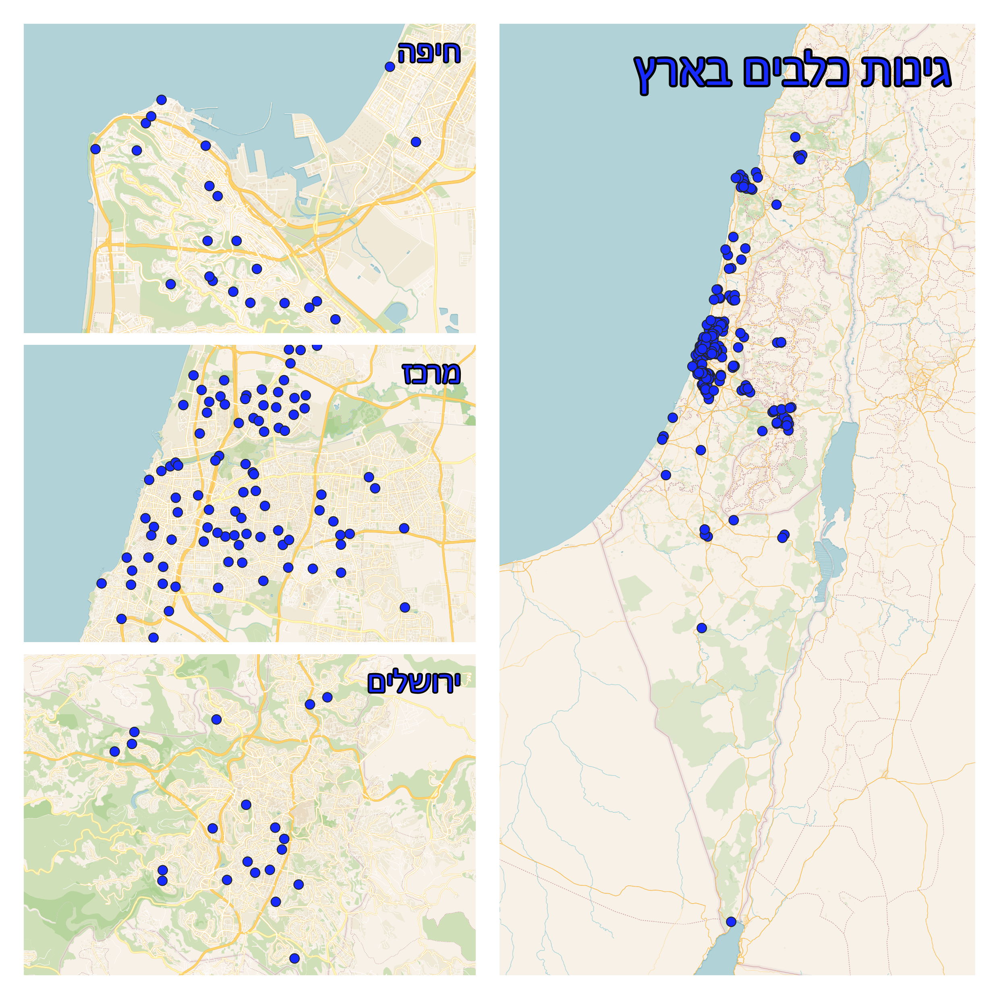
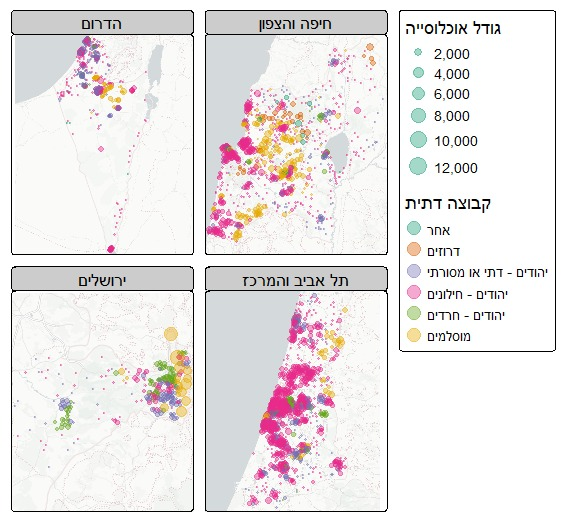
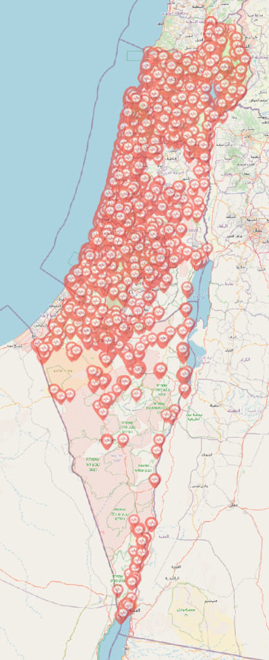
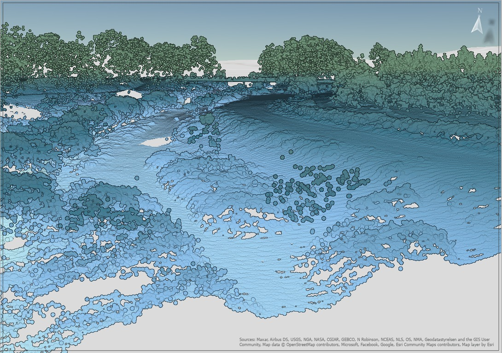
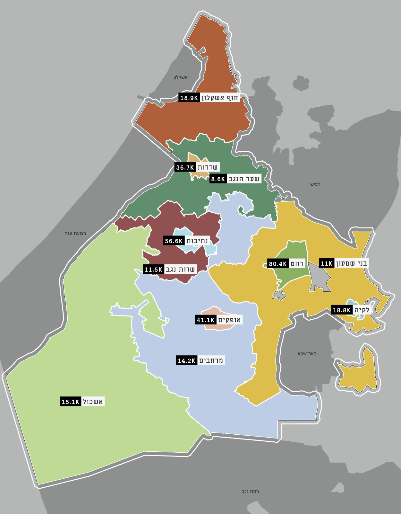

<link rel="stylesheet" href="../rtl.css">

# יום 1: נקודות | Day 1: Points

## נושא | Theme
צרו מפה עם נתוני נקודות - מיקומים, צבירות, נקודות עניין

Create a map with point data - locations, clusters, POIs

## רעיונות | Ideas
- מפת נקודות עניין בעיר שלכם
- צפיפות אוכלוסין עם נקודות
- מיקומי חנויות או שירותים
- נקודות מדידה או תצפית

---

- Map of points of interest in your city
- Population density with points
- Store or service locations
- Measurement or observation points

## תוצאות | Results
הוסיפו את המפה שלכם לתיקיית `images/`!  
Add your map to the `images/` folder!

### עדו קליין

[קישור](https://x.com/idoklein1/status/1984695427359240486)  
### איתן וייס שינברג

[קישור](https://x.com/EithanSchon/status/1984727770799489477)  
### רועי קנת פורטל
יום 1: אזורים סטטיסטיים לפי קבוצה דתית ורמת דתיות ליהודים, מפקד האוכלוסין, 2022, לפי מחוזות (יוצר ב-R, חבילת tmap)  
  
### אליאב שטול-טראורינג
יום 1: דיפיבילטורים בישראל  
  
### שלי אלבז
יום 1 - (ענן) נקודות של נחל  

### ויטלי אויסאטינסקי
לקראת 50 שנה למלחמת יום כיפור, נעשה מיפוי מחדש לכל האנדרטאות/ אתרי הנצחה בשטח המועצה. מופו 172 אתרים. האזור הכי צפוף בארץ מבחינת האנדרטאות ויש אומרים גם בין הצפופים בעולם. לצערי במהלך מלחמת חרבות ברזל נוספו עוד אתרי הנצחה שמחכים למיפוי.  
קובץ v_o.pdf בתיקיית התמונות  

### שיר פוקס
אוכלוסיה ברשויות אשכול נגב מערבי, לפי נתוני ביטוח לאומי יולי 2025.  
אמנם עם תוויות בלבד, אבל נשבעת אלו נקודות ... 😁   

### ניר יריב
 מיקומי פסלים סביבתיים של עזרא אוריון (קודד כמו פעם לפני כמה שנים, נכתב מחדש ע״י קרסור בחצי שעה היום)  
[https://niryariv.github.io/ezra/](https://niryariv.github.io/ezra/)

