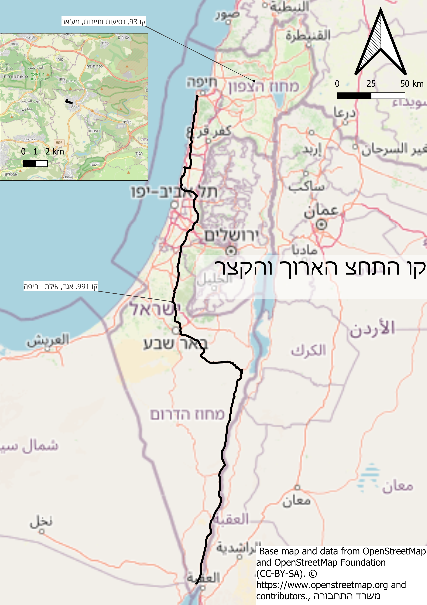
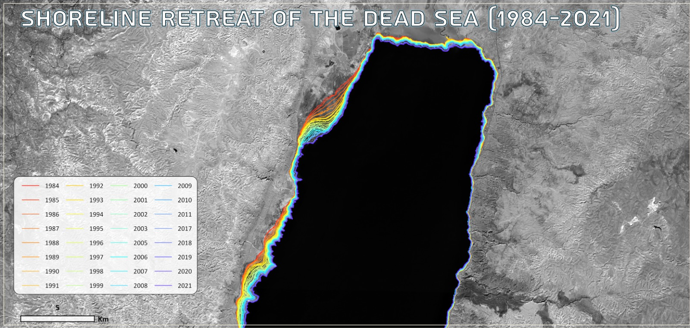
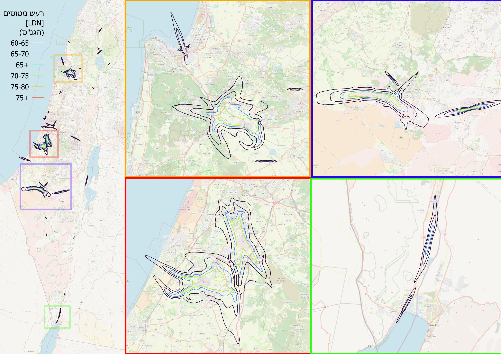
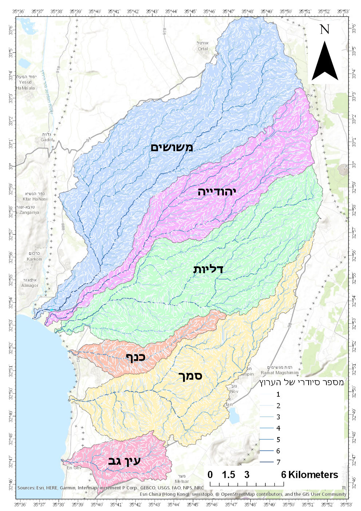
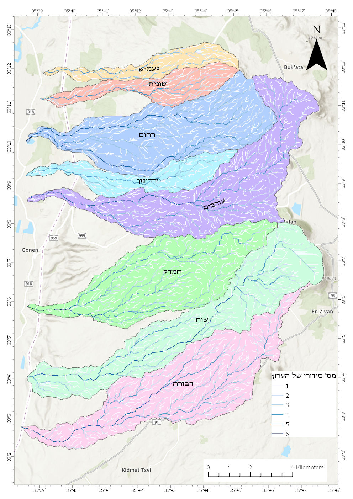
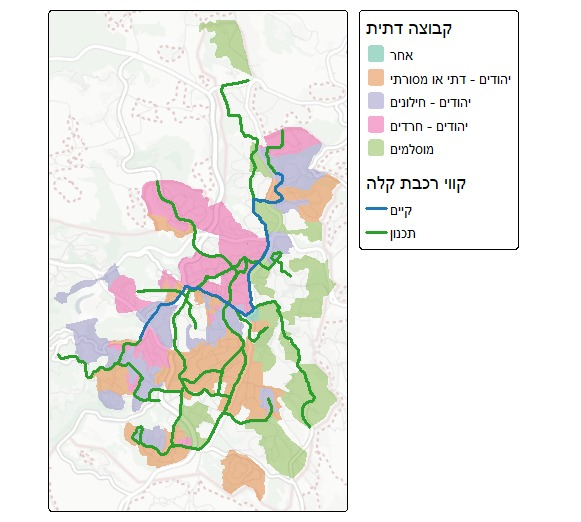
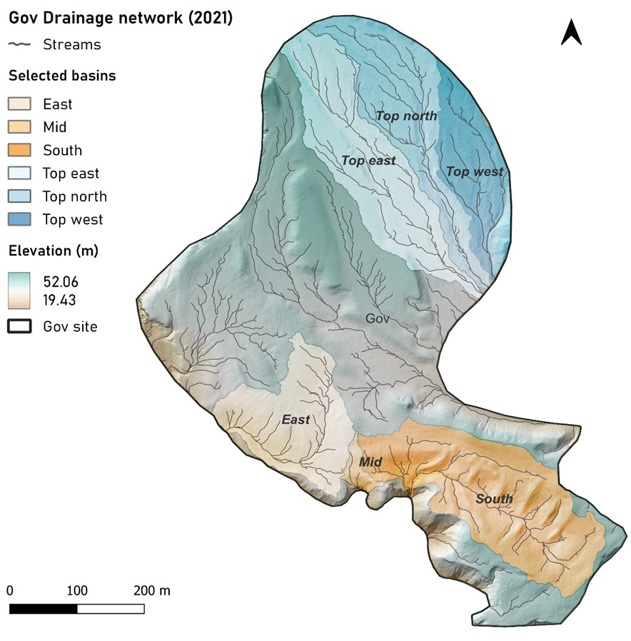
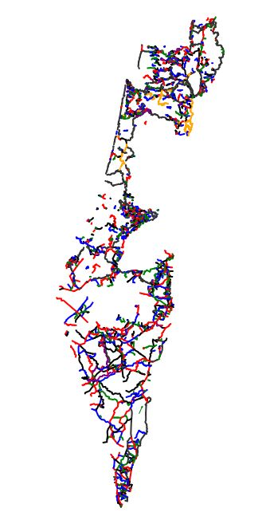

<link rel="stylesheet" href="../rtl.css">

# יום 2: קווים | Day 2: Lines

## נושא | Theme
מפו מאפיינים ליניאריים כמו כבישים, נהרות או קווי זרימה

Map linear features like roads, rivers, or flow lines

## רעיונות | Ideas
- מפת רשת כבישים
- מערכות נהרות
- קווי זרימה ותנועה
- נתיבי תחבורה ציבורית

---

- Road network map
- River systems
- Flow and movement lines
- Public transit routes

## תוצאות | Results
הוסיפו את המפה שלכם לתיקיית `images/`!

Add your map to the `images/` folder!

### איתן וייס שינברג
  
[קישור](https://x.com/EithanSchon/status/1985015997087072397)
### עדו קליין
  
[קישור](https://x.com/idoklein1/status/1985052678750105670)
### שלי אלבז
 נסיגת ים המלח (עיבוד נתוני landsat and sentinel-2)  

### אליאב שטול-טראורינג
  
### אורי אוברמן
[קישור](https://x.com/ori_oberman/status/1985047412730143008)
### ויטלי אויסאטינסקי
ערוצי ניקוז של נחלי הגולן, ניתוח על בסיס DEM  
  
  
### רועי קנת פורטל
 קווי רכבת קלה מתוכננים וקיימים בירושלים על רקע שיוך דתי של אזורים סטטיסטיים, מפקד האוכלוסין ודאטהגוב  
  
### שיר פוקס
ערוצי ניקוז ואגנים קטנים שבחרתי לעסוק בהם בתא השטח של מכרה גוב, מכרות הפוספט בצין. הערוצים הם נגזרת של מודל גבהים מסקר לידר מוטס שבוצע שם בעבר.  

### ניר יריב
שבילים מסומנים בישראל, %100 (כמעט) וייבקוד, קרסור + ג׳פט  
  
[https://niryariv.github.io/trails/](https://niryariv.github.io/trails/)