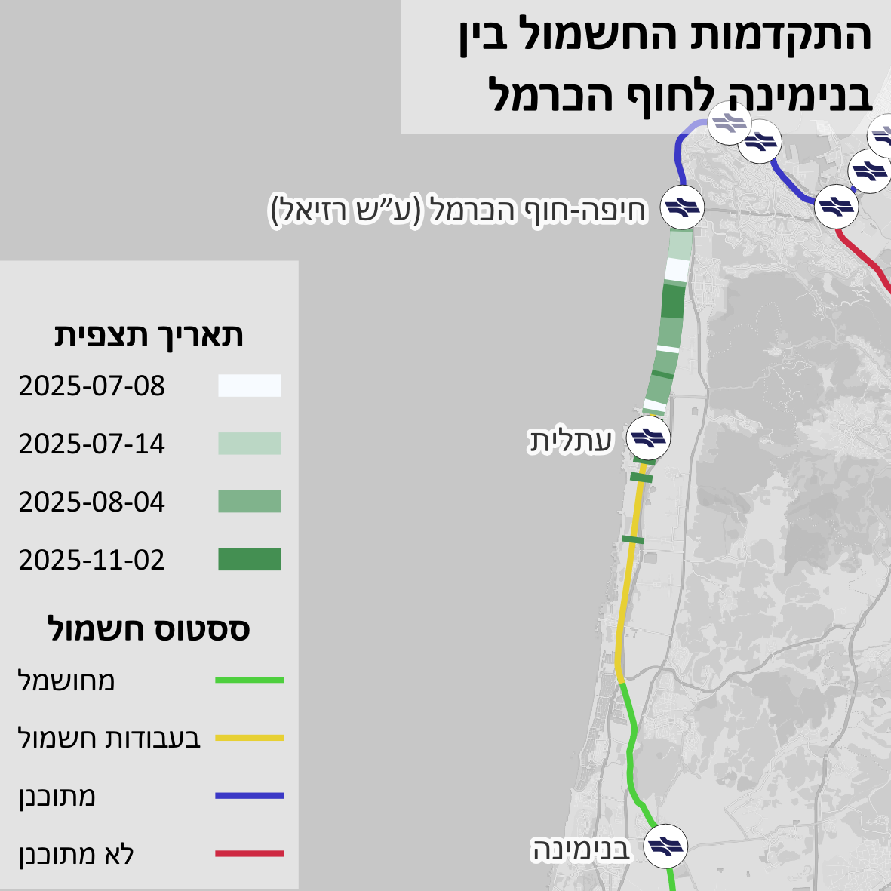
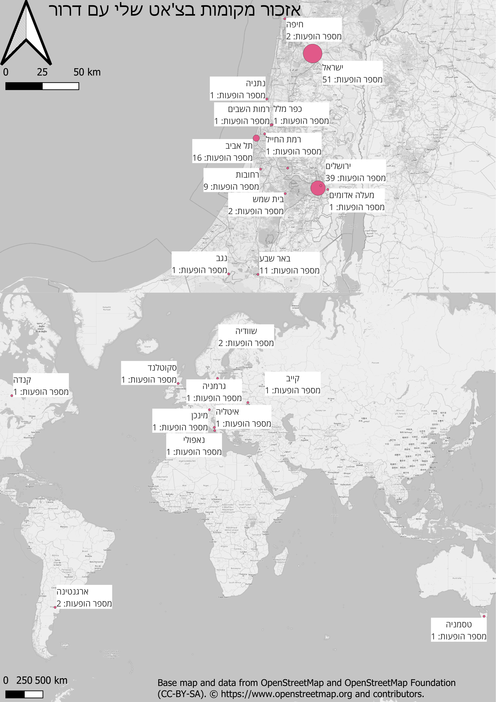
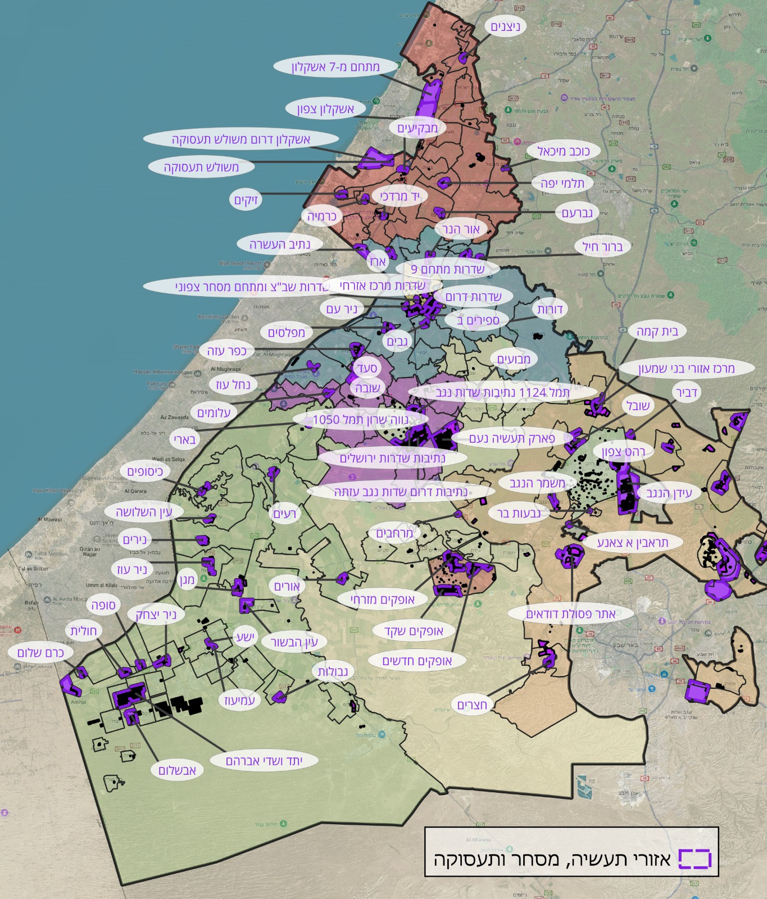
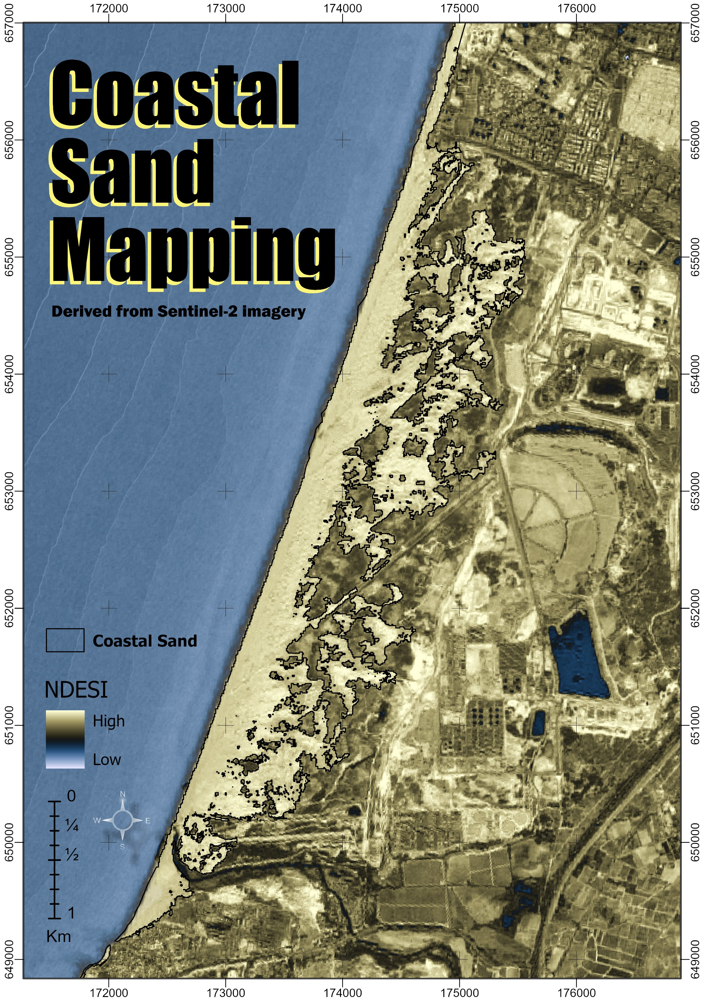

<link rel="stylesheet" href="../rtl.css">

# יום 4: אתגר נתונים - הנתונים שלי | Day 4: Data Challenge: My Data

## נושא | Theme
מפו משהו אישי עם מערך הנתונים שלכם

Map something personal using your own dataset

## רעיונות | Ideas
- מסלולי טיולים אישיים
- מקומות שביקרתם
- נתוני GPS אישיים
- תיעוד פעילות יומיומית

---

- Personal hiking trails
- Places you've visited
- Personal GPS data
- Daily activity tracking

## תוצאות | Results
הוסיפו את המפה שלכם לתיקיית `images/`!

Add your map to the `images/` folder!

### איתן וייס שינברג

[קישור](https://x.com/EithanSchon/status/1985965255865115077)
### עדו קליין

[קישור](https://x.com/idoklein1/status/1985640798939926996)
### שיר פוקס
אזורי תעסוקה תעשיה ומסחר באשכול נגב מערבי 😅  

### שלי אלבז

[קישור](https://x.com/ShellyElbazZ/status/1985589298113007993)