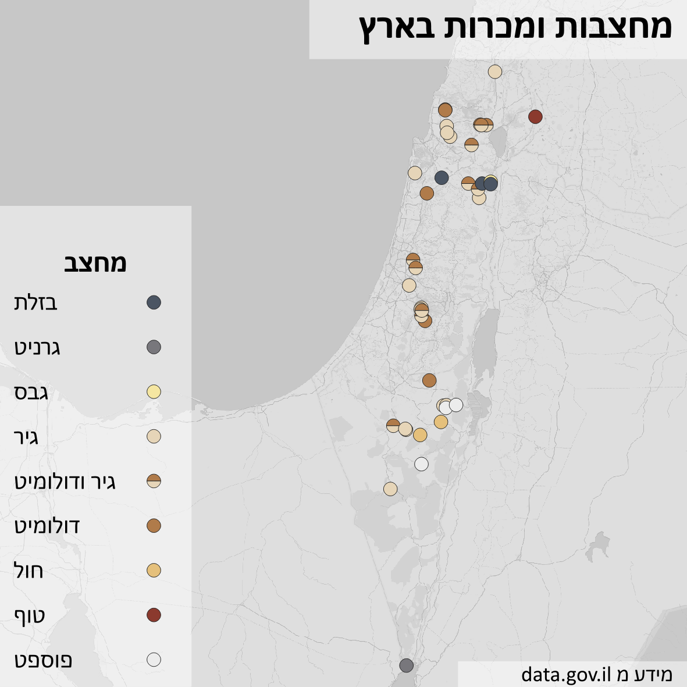
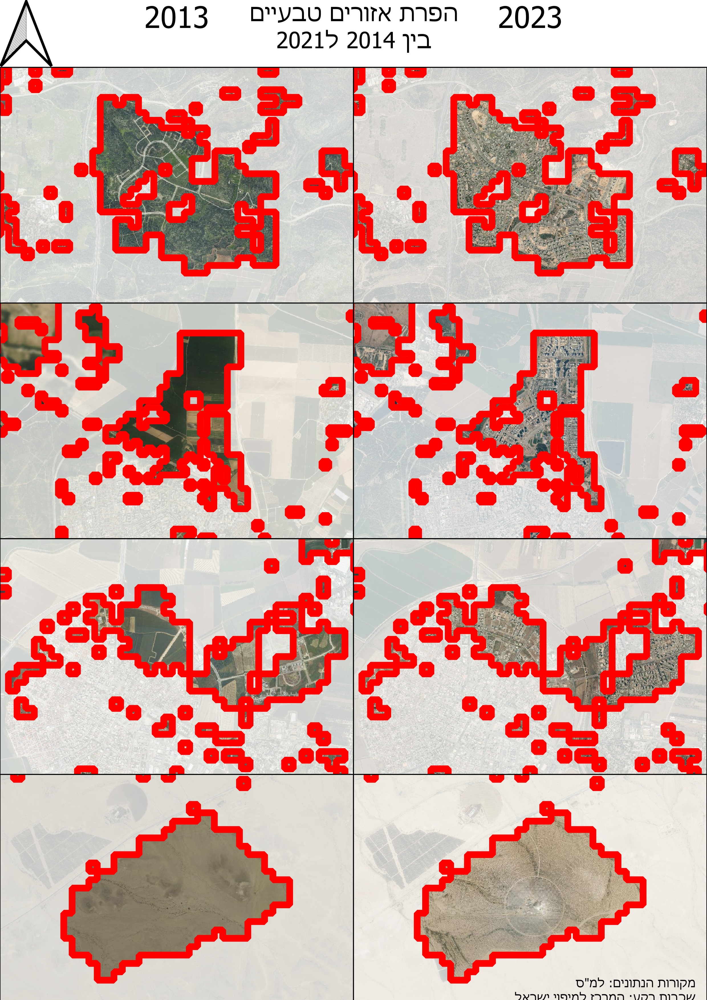
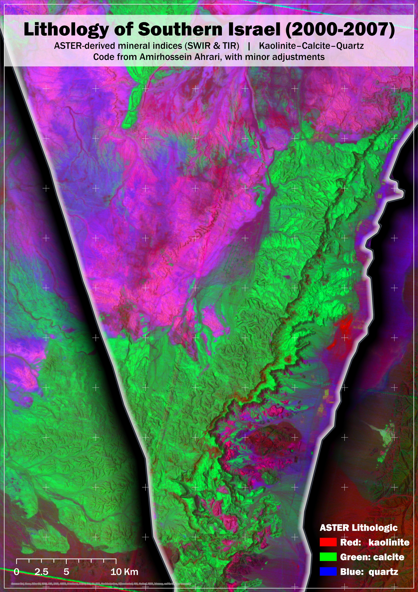
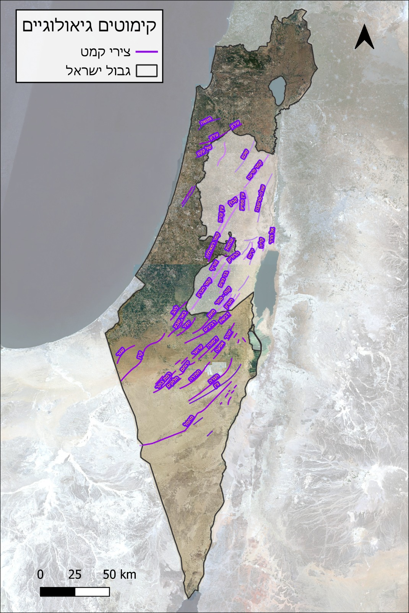

# יום 5: אדמה (יסודות קלאסיים ¼) | Day 5: Earth (Classical Elements ¼)

## נושא | Theme
צורות קרקע, גאולוגיה, קרקע, גובה, או כל דבר מעל/מתחת לאדמה

Landforms, geology, soil, elevation, or anything on/beneath the ground

## רעיונות | Ideas
- מפות טופוגרפיות
- מבנה גיאולוגי
- סוגי קרקע
- מערות ומבנים תת-קרקעיים

---

- Topographic maps
- Geological structures
- Soil types
- Caves and underground structures

## תוצאות | Results
הוסיפו את המפה שלכם לתיקיית `images/`!

Add your map to the `images/` folder!
### איתן וייס שינברג

[קישור](https://x.com/EithanSchon/status/1985965255865115077)
### עדו קליין

[קישור](https://x.com/idoklein1/status/1986059913458577640)
### שלי אלבז

[קישור](https://x.com/ShellyElbazZ/status/1985589298113007993)
### שיר פוקס
קימוטים גיאולוגיים בישראל 🌍⛏️
