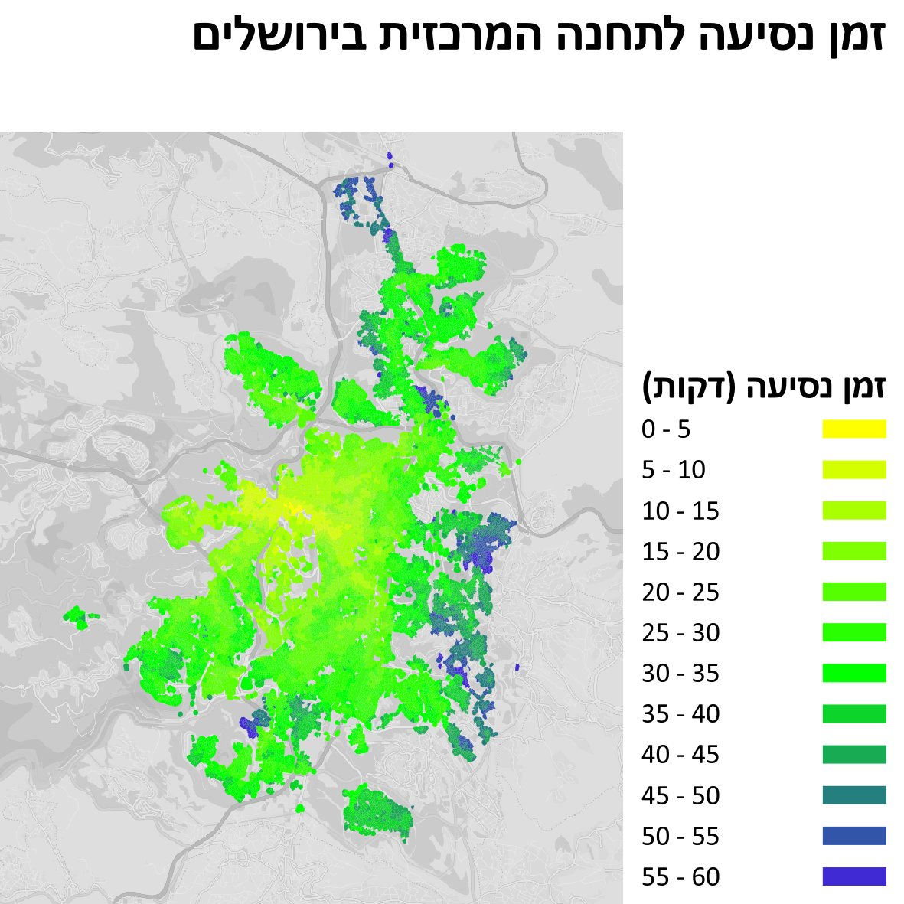
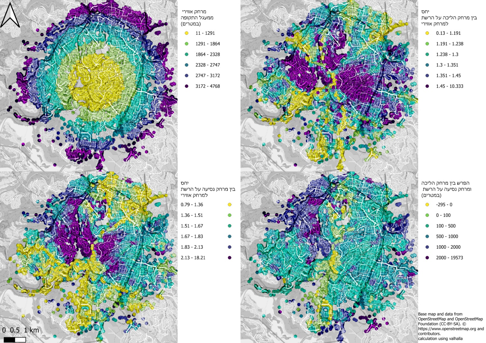
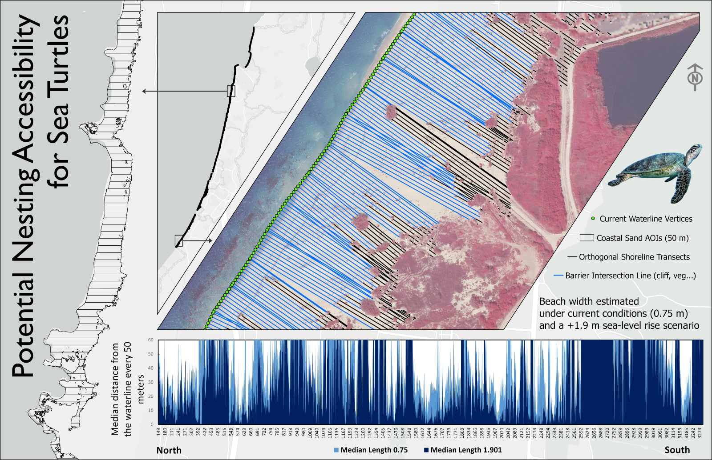

<link rel="stylesheet" href="../rtl.css">

# יום 7: נגישות | Day 7: Accessibility

## נושא | Theme
מפו איך אנשים/דברים מתנייעים - זמני נסיעה, עיצוב כולל, נגישות

Map how people/things get around - travel time, inclusive design, or accessibility itself

## רעיונות | Ideas
- מפות נגישות לנכים
- זמני נסיעה בתחבורה ציבורית
- מרחק הליכה לשירותים
- מפות עיוורי צבעים

---

- Accessibility for disabled people
- Public transit travel times
- Walking distance to services
- Color-blind friendly maps

## תוצאות | Results
הוסיפו את המפה שלכם לתיקיית `images/`!

Add your map to the `images/` folder!
### איתן וייס שינברג

[קישור](https://x.com/EithanSchon/status/1986774050723528792)
### עדו קליין

[קישור](https://x.com/idoklein1/status/1986706497800446343)
### שלי אלבז

[קישור](https://x.com/ShellyElbazZ/status/1986712874979360946)