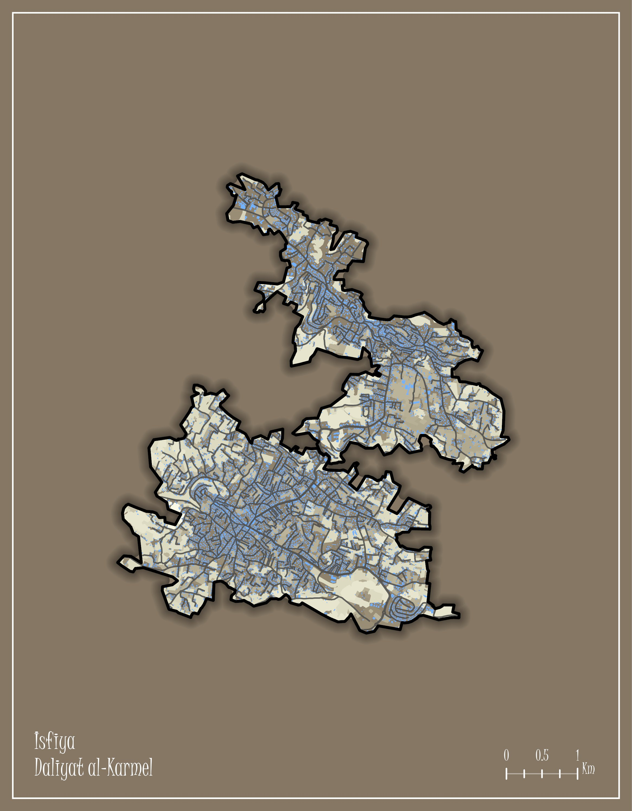
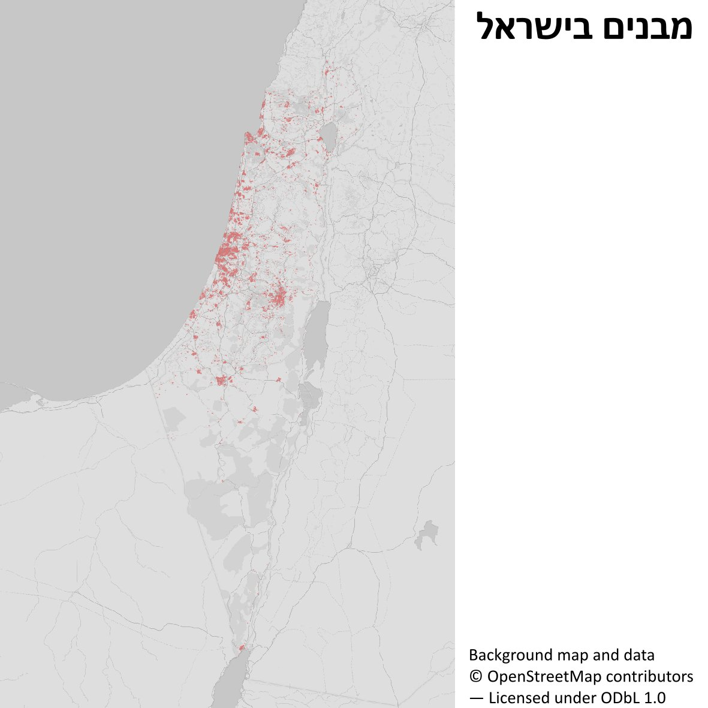
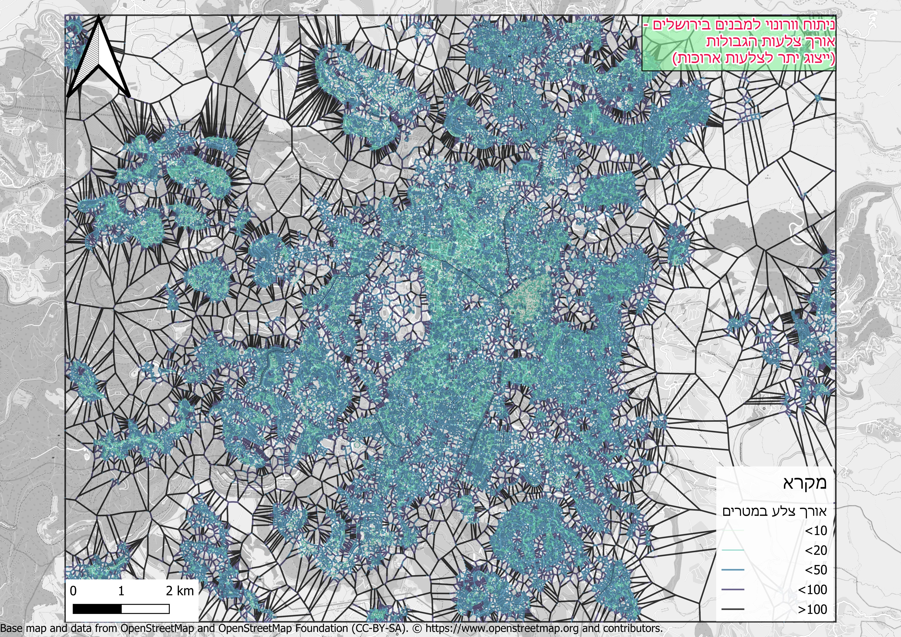

<link rel="stylesheet" href="../rtl.css">

# יום 8: עירוני (יום העיור העולמי) | Day 8: Urban (World Urbanism Day)

## נושא | Theme
מפו סביבות עירוניות - רשתות, תשתיות, צפיפות אוכלוסין

Map city environments - networks, infrastructure, population density

## רעיונות | Ideas
- מפות צפיפות אוכלוסין
- תשתיות עירוניות
- רשתות תחבורה
- פיתוח עירוני

---

- Population density maps
- Urban infrastructure
- Transportation networks
- Urban development

## תוצאות | Results
הוסיפו את המפה שלכם לתיקיית `images/`!

Add your map to the `images/` folder!
### שלי אלבז

[קישור](https://x.com/ShellyElbazZ/status/1987229592675844363)
### איתן וייס שינברג

[קישור](https://x.com/EithanSchon/status/1987247899516764586)
### עדו קליין

[קישור](https://x.com/idoklein1/status/1987255039065313663)