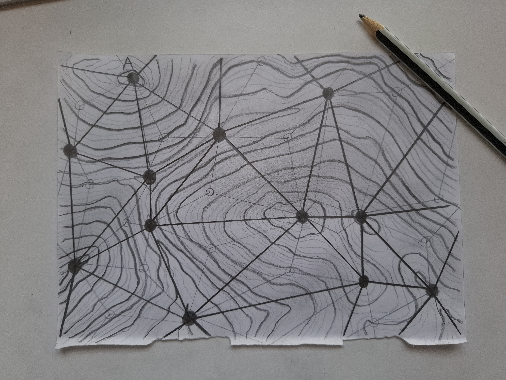
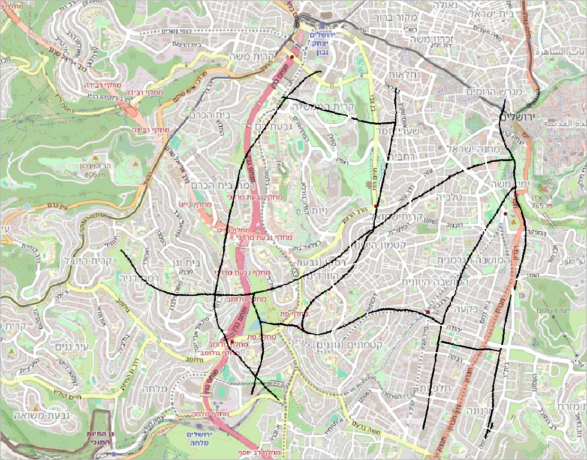

# יום 9: אנלוגי | Day 9: Analog

## נושא | Theme
צרו מפות בשיטות מסורתיות - ציור ביד, צביעה וכדומה

Create maps using traditional methods - hand drawn, painted, etc.

## רעיונות | Ideas
- ציור ביד
- צבעי מים
- עיפרון וצבע
- טכניקות מסורתיות

---

- Hand drawing
- Watercolors
- Pencil and color
- Traditional techniques

## תוצאות | Results
הוסיפו את המפה שלכם לתיקיית `images/`!

Add your map to the `images/` folder!
### שלי אלבז

[קישור](https://x.com/ShellyElbazZ/status/1987436450938225052)
### עדו קליין

[קישור](https://x.com/idoklein1/status/1987409495828382053)