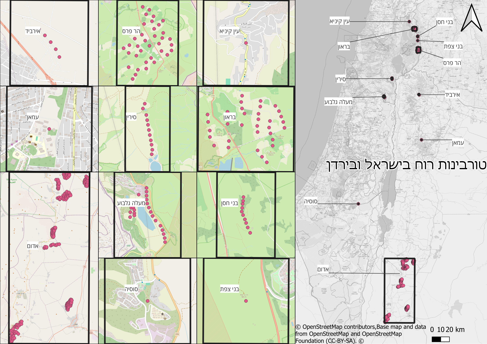

<link rel="stylesheet" href="../rtl.css">

# יום 10: אוויר (יסודות קלאסיים 2/4) | Day 10: Air (Classical Elements 2/4)

## נושא | Theme
מפו תופעות אטמוספריות - מזג אוויר, רוחות, תעבורה אווירית, זיהום

Map atmospheric phenomena - weather, winds, air traffic, pollution

## רעיונות | Ideas
- מפות מזג אוויר
- דפוסי רוח
- מסלולי טיסה
- זיהום אוויר

---

- Weather maps
- Wind patterns
- Flight routes
- Air pollution

## תוצאות | Results
הוסיפו את המפה שלכם לתיקיית `images/`!

Add your map to the `images/` folder!
### שלי אלבז
[קישור](https://x.com/ShellyElbazZ/status/1987836365803778393)
### עדו קליין

[קישור](https://x.com/idoklein1/status/1987775678700245329)